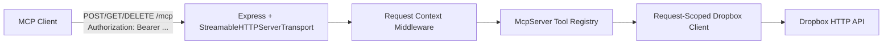

# dbx-mcp-server

`dbx-mcp-server` is a Streamable HTTP MCP server for Dropbox that is stateless with respect to Dropbox credentials: every MCP request must include a Dropbox access token, the server creates a request-scoped Dropbox SDK client, executes the requested tool, and returns the result without storing OAuth state, refresh tokens, or encrypted token files on disk.



## Quickstart

### Docker

```bash
docker build -t dbx-mcp-server .
docker run --rm -p 3000:3000 \
  -e PORT=3000 \
  -e LOG_LEVEL=info \
  -e ALLOWED_ORIGINS=http://localhost:3000 \
  dbx-mcp-server
```

### Docker Compose

```bash
docker compose up --build
```

### Health check

```bash
curl -i http://localhost:3000/healthz
```

### Initialize an MCP session

Replace `<DROPBOX_ACCESS_TOKEN>` with a token obtained from Dropbox. Use Dropbox’s OAuth guide for token acquisition and scope planning: https://developers.dropbox.com/oauth-guide

```bash
curl -sS http://localhost:3000/mcp \
  -H 'Content-Type: application/json' \
  -H 'Accept: application/json, text/event-stream' \
  -H 'Authorization: Bearer <DROPBOX_ACCESS_TOKEN>' \
  --data '{
    "jsonrpc": "2.0",
    "id": "init-1",
    "method": "initialize",
    "params": {
      "protocolVersion": "2025-03-26",
      "capabilities": {},
      "clientInfo": {
        "name": "curl-client",
        "version": "0.1.0"
      }
    }
  }'
```

## Architecture Notes

- Transport: Streamable HTTP on `/mcp`
- Health endpoint: `GET /healthz`
- Token sources, in order:
  - `Authorization: Bearer <dropbox_access_token>`
  - `X-Dropbox-Access-Token: <token>`
- Optional Dropbox Business delegation headers:
  - `X-Dropbox-Select-User: <team_member_id>`
  - `X-Dropbox-Select-Admin: <team_admin_member_id>`
- Session model: MCP session IDs are managed by `StreamableHTTPServerTransport`; Dropbox credentials are not
- Path root override: every tool accepts optional `path_root`
- Logging: JSON via `pino`; access tokens and token-like fields are redacted
- Rate limiting: Dropbox `429` responses are retried with exponential backoff plus `Retry-After`

## Configuration

| Env var | Default | Purpose |
| --- | --- | --- |
| `PORT` | `3000` | HTTP listen port |
| `LOG_LEVEL` | `info` | Pino log level |
| `ALLOWED_ORIGINS` | empty | Comma-separated extra origins allowed to call `/mcp`; localhost origins are always accepted |
| `SHUTDOWN_TIMEOUT_MS` | `30000` | Graceful shutdown timeout |
| `DROPBOX_RETRY_MAX_ATTEMPTS` | `3` | Maximum retry attempts for Dropbox `429` responses |
| `DROPBOX_RETRY_BASE_DELAY_MS` | `250` | Base exponential backoff delay in milliseconds |
| `DROPBOX_SELECT_USER` | unset | Local testing fallback for Dropbox Business delegation when the request does not send `X-Dropbox-Select-User` |
| `DROPBOX_SELECT_ADMIN` | unset | Local testing fallback for Dropbox admin delegation when the request does not send `X-Dropbox-Select-Admin` |

## Common Input: `path_root`

All tools accept optional `path_root` with one of these shapes:

```json
{ ".tag": "home" }
```

```json
{ ".tag": "root", "root": "1234567890" }
```

```json
{ ".tag": "namespace_id", "namespace_id": "1234567890" }
```

## Optional Request Headers

These are not required for normal user-scoped tokens, but they are useful for Dropbox Business team tokens:

- `X-Dropbox-Select-User`
  - Passes Dropbox `selectUser` through the SDK so file and account routes operate on a specific team member
- `X-Dropbox-Select-Admin`
  - Passes Dropbox `selectAdmin` through the SDK for admin-scoped team operations
- Local-only fallback:
  - `DROPBOX_SELECT_USER` and `DROPBOX_SELECT_ADMIN` are accepted only as convenience fallbacks for local testing
  - request headers still take priority

## Tool Reference

Each example below is the `params` payload for `tools/call`.

### File Operations

| Tool | Input schema | Output schema | Example invocation |
| --- | --- | --- | --- |
| `list_folder` | `path?: string`, `recursive?: boolean`, `include_media_info?: boolean`, `include_deleted?: boolean`, `include_has_explicit_shared_members?: boolean`, `include_mounted_folders?: boolean`, `limit?: integer`, `include_non_downloadable_files?: boolean`, `path_root?` | Dropbox `files.ListFolderResult` | `{"name":"list_folder","arguments":{"path":"/Docs","recursive":false}}` |
| `list_files` | Same as `list_folder`; deprecated alias | Dropbox `files.ListFolderResult` | `{"name":"list_files","arguments":{"path":"/Docs"}}` |
| `list_folder_continue` | `cursor: string`, `path_root?` | Dropbox `files.ListFolderResult` | `{"name":"list_folder_continue","arguments":{"cursor":"cursor-1"}}` |
| `get_metadata` | `path: string`, `include_media_info?: boolean`, `include_deleted?: boolean`, `include_has_explicit_shared_members?: boolean`, `path_root?` | Dropbox metadata object from `filesGetMetadata` | `{"name":"get_metadata","arguments":{"path":"/Docs/report.pdf"}}` |
| `create_folder` | `path: string`, `autorename?: boolean`, `path_root?` | Dropbox `files.CreateFolderResult` | `{"name":"create_folder","arguments":{"path":"/Docs/New Folder"}}` |
| `delete` | `path: string`, `parent_rev?: string`, `path_root?` | Dropbox `files.DeleteResult` | `{"name":"delete","arguments":{"path":"/Docs/old.txt"}}` |
| `delete_batch` | `entries: [{ path: string, parent_rev?: string }]`, `poll_interval_ms?: integer`, `max_poll_attempts?: integer`, `path_root?` | Dropbox completed `files.DeleteBatchLaunch` or polled `files.DeleteBatchJobStatus` | `{"name":"delete_batch","arguments":{"entries":[{"path":"/Docs/a.txt"},{"path":"/Docs/b.txt"}]}}` |
| `move` | `from_path: string`, `to_path: string`, `allow_shared_folder?: boolean`, `autorename?: boolean`, `allow_ownership_transfer?: boolean`, `path_root?` | Dropbox `files.RelocationResult` | `{"name":"move","arguments":{"from_path":"/Docs/a.txt","to_path":"/Archive/a.txt"}}` |
| `move_batch` | `entries: [{ from_path: string, to_path: string }]`, `autorename?: boolean`, `allow_ownership_transfer?: boolean`, `poll_interval_ms?: integer`, `max_poll_attempts?: integer`, `path_root?` | Dropbox completed `files.RelocationBatchV2Launch` or polled `files.RelocationBatchV2JobStatus` | `{"name":"move_batch","arguments":{"entries":[{"from_path":"/Docs/a.txt","to_path":"/Archive/a.txt"}]}}` |
| `copy` | `from_path: string`, `to_path: string`, `allow_shared_folder?: boolean`, `autorename?: boolean`, `allow_ownership_transfer?: boolean`, `path_root?` | Dropbox `files.RelocationResult` | `{"name":"copy","arguments":{"from_path":"/Docs/a.txt","to_path":"/Copies/a.txt"}}` |
| `copy_batch` | `entries: [{ from_path: string, to_path: string }]`, `autorename?: boolean`, `poll_interval_ms?: integer`, `max_poll_attempts?: integer`, `path_root?` | Dropbox completed `files.RelocationBatchV2Launch` or polled `files.RelocationBatchV2JobStatus` | `{"name":"copy_batch","arguments":{"entries":[{"from_path":"/Docs/a.txt","to_path":"/Copies/a.txt"}]}}` |

### Upload and Download

| Tool | Input schema | Output schema | Example invocation |
| --- | --- | --- | --- |
| `upload_file` | `path: string`, `content: string` (base64), `mode?: {".tag":"add"|"overwrite"} | {".tag":"update","update":"rev"}`, `autorename?: boolean`, `client_modified?: ISO datetime`, `mute?: boolean`, `strict_conflict?: boolean`, `content_hash?: string`, `path_root?` | Dropbox `files.FileMetadata` | `{"name":"upload_file","arguments":{"path":"/Docs/hello.txt","content":"SGVsbG8="}}` |
| `upload_file_chunked` | Same as `upload_file` plus `chunk_size_bytes?: integer`; auto-routes to direct upload at `<=150 MB` and upload sessions above that | `{ "route": "direct"|"chunked", "result": Dropbox result }` | `{"name":"upload_file_chunked","arguments":{"path":"/Large/video.bin","content":"<base64>","chunk_size_bytes":8388608}}` |
| `download_file` | `path: string`, `path_root?` | `{ "metadata": Dropbox file metadata, "content_base64": string|null, "content_hash": string|null }` | `{"name":"download_file","arguments":{"path":"/Docs/hello.txt"}}` |

### Search

| Tool | Input schema | Output schema | Example invocation |
| --- | --- | --- | --- |
| `search` | `query: string`, `path?: string`, `max_results?: integer`, `order_by?: "relevance"|"last_modified_time"`, `file_status?: "active"|"deleted"`, `filename_only?: boolean`, `file_extensions?: string[]`, `file_categories?: ("image"|"document"|"pdf"|"spreadsheet"|"presentation"|"audio"|"video"|"folder"|"paper"|"others")[]`, `account_id?: string`, `include_highlights?: boolean`, `path_root?` | Dropbox `files.SearchV2Result` | `{"name":"search","arguments":{"query":"report","path":"/Docs","max_results":25}}` |
| `search_file_db` | Same as `search`; deprecated alias | Dropbox `files.SearchV2Result` | `{"name":"search_file_db","arguments":{"query":"report"}}` |
| `search_continue` | `cursor: string`, `path_root?` | Dropbox `files.SearchV2Result` | `{"name":"search_continue","arguments":{"cursor":"cursor-1"}}` |

### Revisions

| Tool | Input schema | Output schema | Example invocation |
| --- | --- | --- | --- |
| `list_revisions` | `path: string`, `mode?: "path"|"id"`, `limit?: integer`, `path_root?` | Dropbox `files.ListRevisionsResult` | `{"name":"list_revisions","arguments":{"path":"/Docs/report.docx","limit":10}}` |
| `restore_revision` | `path: string`, `rev: string`, `path_root?` | Dropbox `files.FileMetadata` | `{"name":"restore_revision","arguments":{"path":"/Docs/report.docx","rev":"a1c10ce0dd78"}}` |

### Sharing

| Tool | Input schema | Output schema | Example invocation |
| --- | --- | --- | --- |
| `create_shared_link` | `path: string`, `requested_visibility?: "public"|"team_only"|"password"` default `public`, `audience?: "public"|"team"|"no_one"|"password"|"members"` default `public`, `access?: "viewer"|"editor"|"max"|"default"`, `allow_download?: boolean` default `true`, `expires?: ISO datetime`, `link_password?: string`, `require_password?: boolean`, `path_root?` | Dropbox shared-link metadata plus `direct_download_url`, `resolved_visibility`, and optional `reused_existing_link` | `{"name":"create_shared_link","arguments":{"path":"/Docs/report.pdf","allow_download":true}}` |
| `get_temporary_link` | `path: string`, `path_root?` | Dropbox `files.GetTemporaryLinkResult` | `{"name":"get_temporary_link","arguments":{"path":"/Docs/report.pdf"}}` |
| `list_shared_links` | `path?: string`, `cursor?: string`, `direct_only?: boolean`, `path_root?` | Dropbox `sharing.ListSharedLinksResult` | `{"name":"list_shared_links","arguments":{"path":"/Docs/report.pdf","direct_only":true}}` |
| `revoke_shared_link` | `url: string`, `path_root?` | `{ "revoked": true, "url": string }` | `{"name":"revoke_shared_link","arguments":{"url":"https://www.dropbox.com/s/example"}}` |
| `modify_shared_link_settings` | `url: string`, `settings: { requested_visibility?: "public"|"team_only"|"password", audience?: "public"|"team"|"no_one"|"password"|"members", access?: "viewer"|"editor"|"max"|"default", allow_download?: boolean, expires?: ISO datetime, link_password?: string, require_password?: boolean }`, `remove_expiration?: boolean`, `path_root?` | Updated Dropbox shared-link metadata | `{"name":"modify_shared_link_settings","arguments":{"url":"https://www.dropbox.com/s/example","settings":{"allow_download":true}}}` |
| `get_shared_link_metadata` | `url: string`, `path?: string`, `link_password?: string`, `path_root?` | Dropbox shared-link metadata | `{"name":"get_shared_link_metadata","arguments":{"url":"https://www.dropbox.com/s/example"}}` |

### Account

| Tool | Input schema | Output schema | Example invocation |
| --- | --- | --- | --- |
| `get_current_account` | `path_root?` | Dropbox `users.FullAccount` | `{"name":"get_current_account","arguments":{}}` |
| `get_space_usage` | `path_root?` | Dropbox `users.SpaceUsage` | `{"name":"get_space_usage","arguments":{}}` |

## Operational Notes

- The server never stores Dropbox access tokens, refresh tokens, PKCE state, or encrypted token files
- `Authorization` headers are preferred; `X-Dropbox-Access-Token` is supported for environments where `Authorization` is reserved
- Public shared-link download behavior follows Dropbox’s `?dl=1` force-download convention: https://help.dropbox.com/share/force-download
- Temporary link behavior is documented by Dropbox as a direct-download URL with a 4-hour TTL:
  - endpoint docs: https://www.dropbox.com/developers/documentation/http/documentation#files-get_temporary_link
  - staff confirmation: https://www.dropboxforum.com/t5/Dropbox-API-Support-Feedback/Expiration-settings-of-Temporary-Link/td-p/272061
- Error-code meanings are documented in [docs/ERROR_CODES.md](docs/ERROR_CODES.md)

## Development

```bash
npm install
npm run build
npm test
npm run typecheck
```

## License

MIT
